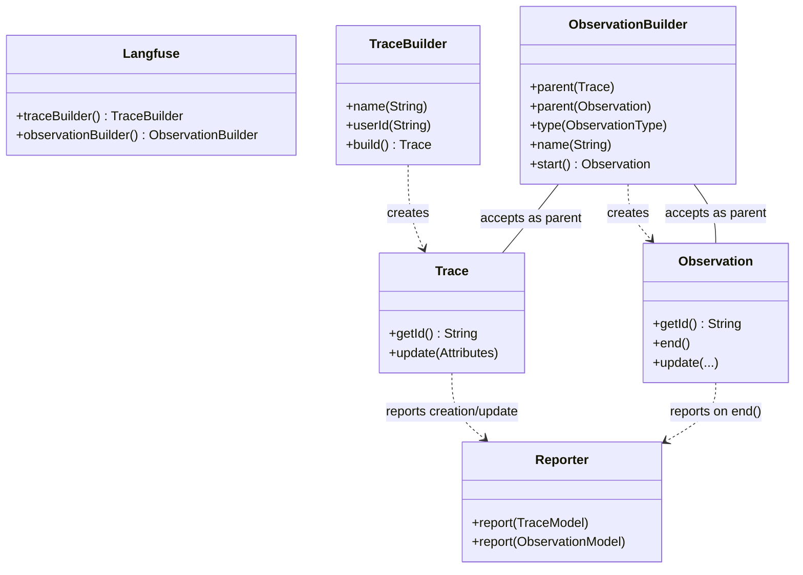

# Design: Trace & Observation API

## Overview

Replaces generic "Span" architecture with domain-specific "Trace" and "Observation" entities.
Maintains OTel-style fluent builders and explicit parentage.

## Class Diagram



## Detailed Flow

### 1. Starting a Trace

```java
Trace trace = Langfuse.traceBuilder()
    .name("chat-session")
    .userId("u-123")
    .build(); // triggers report(traceModel)
```

### 2. Starting a Root Observation

```java
Observation rootSpan = Langfuse.observationBuilder()
    .parent(trace) // Links to trace, no parent observation
    .name("process-request")
    .type(ObservationType.SPAN)
    .start();
```

### 3. Starting a Child Observation

```java
Observation childGen = Langfuse.observationBuilder()
    .parent(rootSpan) // Links to trace (via root) and parent observation
    .name("llm-call")
    .type(ObservationType.GENERATION)
    .start();

// ... work ...
childGen.end(); // triggers report(observationModel)
```

### 4. Ending Root

```java
rootSpan.end();
```

## Internal Data Models

- `com.antigravity.langfuse.domain.Trace` (POJO) -> Renamed to `TraceAttributes` or handled internally.
- `com.antigravity.langfuse.domain.Observation` (POJO) -> Renamed to `ObservationAttributes` or handled internally.
- SDK Entities (`Trace`, `Observation`) wrapper these models and handle state/reporting logic.
