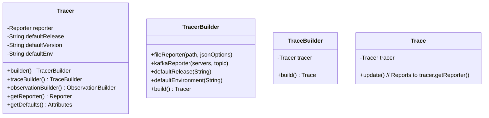

# Design: Tracer Refactor

## Class Diagram



## Migration Path

1.  **Introduce `Tracer`**: Create the new class and builder.
2.  **Refactor Models/SDK**: Update `Trace` and `Observation` to accept `Tracer` (or `Reporter` + defaults) in their constructors.
3.  **Deprecate/Convert `Langfuse`**:
    - Ideally remove `Langfuse.java` entirely as requested ("Langfuse changed to Tracer").
    - If needed for migration, `Langfuse` could hold a static `Tracer` instance, but the request implies a rename.

## Dependency Injection

Instead of `Trace` calling `Langfuse.getReporter()`, the `Tracer` factory method will pass the reporter (or the `Tracer` itself) to the `Trace` constructor.

```java
// Tracer.java
public TraceBuilder traceBuilder() {
    return new TraceBuilder(this);
}

// TraceBuilder.java
public Trace build() {
    return new Trace(this.tracer, ...);
}
```
